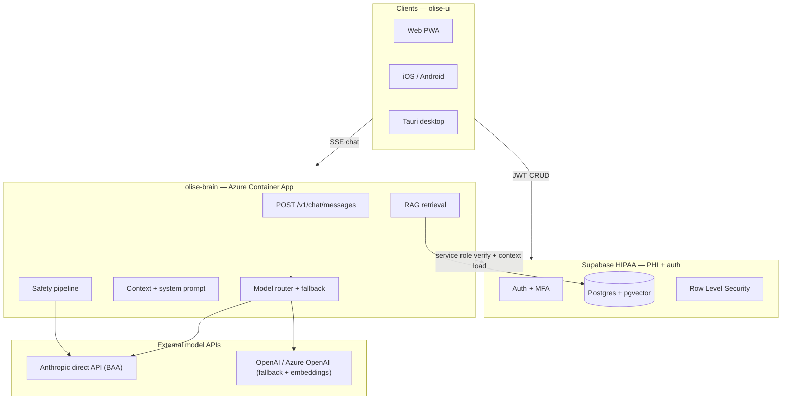
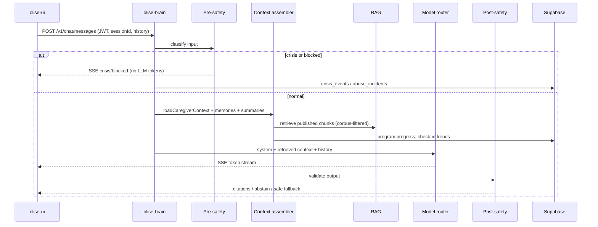
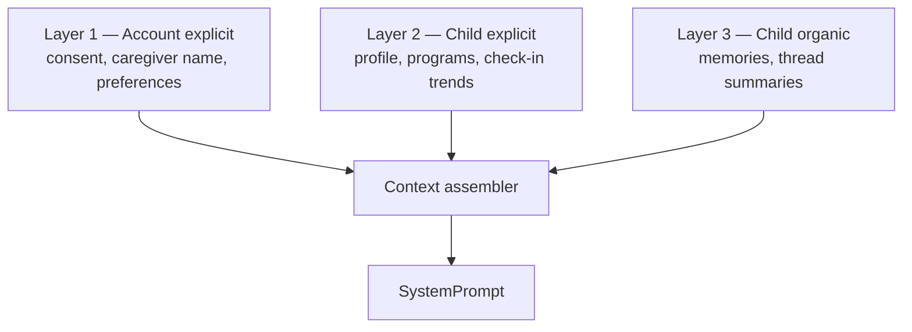

# Olise — System & Model Architecture

**Audience:** Technical leads (ML systems, safety, infra). Written for someone who has built large-scale model serving and evaluation pipelines — e.g. ex–DeepMind — and needs a precise picture of what Olise is, what is shipped today, and where the architecture is headed.

**Product:** Olise is a **caregiver-facing pediatric behavioral health platform** (T3 Labs). It is **guidance-only v1** — educational support, programs, daily routines, and contextual chat. It is **not** a clinical service: no prescribing, no synchronous therapy, no insurance billing.

**Repos (sibling layout):**

| Repo | Role |
|------|------|
| `olise-ui` | React client — web PWA, iOS/Android (Capacitor), desktop (Tauri 2) |
| `olise-supabase` | Postgres schema, RLS, migrations, seed data |
| `olise-brain` | Azure Container App — chat orchestration, model routing, safety (growing) |

Legacy Azure resource names still use `nira-*`; product brand is Olise.

---

## 1. Design thesis

We are **not** building a single fine-tuned “pediatric LLM.” We are building a **governed orchestration stack** where:

1. **Owned IP lives in structured stores** — clinical content, biomarker corpus, assessment instruments — retrieved at query time (RAG), not memorized in weights.
2. **The LLM is a reasoning and language layer** over grounded context, with hard abstention when retrieval is empty or low-confidence.
3. **Safety-critical paths are deterministic** — crisis escalation, licensed instrument scoring, and (target) jailbreak blocking do not rely on the main model’s judgment alone.
4. **PHI never touches the client-side model path** — the brain runs server-side; the UI streams SSE from `olise-brain` with a Supabase JWT.

This is closer to a **vertical health copilot with retrieval boundaries** than to training a domain foundation model.

---

## 2. System topology



### Trust boundaries

| Layer | Sees PHI? | Sees system prompts / RAG? | Notes |
|-------|-----------|------------------------------|-------|
| Client (`olise-ui`) | Yes (user’s own data via RLS) | **No** | Never calls LLM APIs directly |
| Supabase | Yes (encrypted at rest) | No | Auth, CRUD, vectors, audit tables |
| `olise-brain` | Yes (per-request context assembly) | Yes | Only server that talks to LLMs |
| Anthropic / OpenAI | Yes (in-flight message content) | Partial (system prompt) | Contractual BAA + zero retention |

**Critical compliance constraint:** Anthropic’s HIPAA BAA covers the **first-party API** (`api.anthropic.com`) only. Claude via AWS Bedrock or Azure Foundry is **out of scope** for PHI chat. Embeddings may run on Azure OpenAI under Azure’s BAA (owned document text at ingest — not user chats).

---

## 3. What is shipped today (staging)

Honest snapshot as of desktop **v0.1.3** and Tier 1 product polish:

| Capability | Status |
|------------|--------|
| Supabase Auth (email, MFA in Settings) | **Shipped** |
| Caregiver + child profiles, consent, RLS | **Shipped** |
| Chat sessions + messages in Postgres | **Shipped** (brain-authoritative) |
| SSE streaming chat via `olise-brain` | **Shipped** |
| Personalized system prompt (caregiver + children + focus child) | **Shipped** |
| Model chain with retry + fallback | **Shipped** |
| Pre/post safety (regex + Haiku classifier) | **Shipped** |
| Crisis UX + `crisis_events` + internal webhook | **Shipped** |
| Jailbreak / extraction blocking | **Shipped** |
| Clinical RAG (ingest, retrieve, cite, abstain) | **Shipped** (staging corpus seeded) |
| Eval harness + CI gate | **Shipped** (31 scenarios, 5 buckets) |
| `model_calls` + `safety_verdicts` telemetry | **Shipped** |
| Programs, routines, check-ins UI | **Shipped** |
| Child memories + conversation summaries | **Schema only** |
| Deterministic assessment scoring | **Schema only** |

Staging UI: `https://olise-ui-staging.grayocean-e370e875.eastus.azurecontainerapps.io`  
Staging brain: `https://nira-brain-staging.grayocean-e370e875.eastus.azurecontainerapps.io`

---

## 4. Model architecture

### 4.1 Role separation (target v1 stack)

| Role | Provider | Model class | Purpose |
|------|----------|-------------|---------|
| **Primary chat** | Anthropic (direct) | Claude Sonnet (e.g. `claude-sonnet-4-6`) | Main caregiver dialogue; streaming |
| **Fallback chat** | Anthropic → OpenAI | Haiku → `gpt-4.1-mini` | Availability + cost under load |
| **Safety classifier** | Anthropic (direct) | Haiku | Pre/post JSON classification (planned) |
| **Summarization** | Anthropic (direct) | Haiku | Thread compression for context budget (planned) |
| **Embeddings** | Azure OpenAI | `text-embedding-3-large` (1536-d) | Ingest-time only on owned corpus |

We explicitly **do not** fine-tune on caregiver PHI for v1. If fine-tuning happens later, it would be on **de-identified** style/safety exemplars — not raw chat logs.

### 4.2 Model chain (implemented)

Configured via `CHAT_MODEL_CHAIN` in `olise-brain`:

```
anthropic:claude-sonnet-4-6,anthropic:claude-haiku-4-5,openai:gpt-4.1-mini
```

Router behavior (`src/router/modelRouter.ts`):

1. Try each spec in order; skip providers without API keys.
2. Up to **3 retries** per spec with exponential backoff on retryable errors (429, 5xx).
3. On success after tier > 0, log fallback usage (UI indicator planned).
4. Surface user-safe error if entire chain fails.

This is **reliability routing**, not capability routing (no query-level model selection yet).

### 4.3 Provider abstraction

Internal `ChatProvider` interface: `isConfigured()`, `stream({ model, system, history, content, sink })`. Anthropic and OpenAI are adapters. Adding a provider does not require client changes.

### 4.4 Model selection governance (planned)

- **Bake-off** on ~100–200 de-identified scenarios before locking models.
- **ADR** documenting provider, model IDs, latency p95, cost/conversation, safety pass rate.
- **CI regression** on prompt/model/RAG changes via eval harness.
- **Pinned versions** in env config; feature flags for rollout.

---

## 5. Per-turn request pipeline

### 5.1 Target pipeline (full brain)



### 5.2 Implemented today

```
JWT verify → keyword crisis check → loadCaregiverContext → buildSystemPrompt → streamWithFallback → SSE done
```

Crisis path returns a **fixed template** (988, 911) — no LLM generation. See `olise-brain/src/crisis.ts`, `src/chat.ts`.

### 5.3 API contract

`POST /v1/chat/messages` — SSE events:

| Event | Payload | Status |
|-------|---------|--------|
| `token` | `{ text }` | Shipped |
| `done` | `{ messageId }` | Shipped |
| `error` | `{ message }` | Shipped |
| `meta` | `{ crisis: true }` | Shipped |
| `citation` | chunk metadata | Planned |
| `crisis` | `{ crisis_event_id, category, resources }` | Planned (richer than meta) |
| `blocked` | `{ code, message }` | Planned |

History: last **40** turns, client-supplied. Context window management via summaries is planned.

---

## 6. Context model

Caregivers use **two interaction modes** in one product:

| Mode | Analogy | Brain context |
|------|---------|---------------|
| **General chat** | Main Claude chat (no project) | Layer 1 + RAG; no child PHI in prompt |
| **Child-scoped session** | Claude Project per child | Layers 1–3 for one `child_id` |

### Three context layers



**Layer 1** — Always after consent: caregiver display name, role, consent version.

**Layer 2** — Structured child fields (PHI-minimized by design):

- Display name (nickname), **age band** (not DOB), condition enums, optional medication/care-team notes.
- Program progress and routine check-in history (trend-aware responses planned).

**Layer 3** — Organic learning (`child_memories`):

- Extracted facts with `category`, `confidence`, `user_confirmed`.
- Clinical facts require caregiver confirmation before durable use.
- **Never** written from general-mode chat without a `child_id`.

### Focus child resolution (shipped)

Priority order (`resolveFocusChild`):

1. `chat_sessions.child_id` when `sessionId` passed and ownership verified  
2. `caregiver_profiles.active_child_id`  
3. Single child on account → auto-focus  
4. Else `null` → general multi-child mode  

Implemented in `olise-brain/src/context/loadCaregiverContext.ts` and `src/prompt.ts`.

### Cross-space intelligence (locked design)

In **general** chat, if the caregiver names a child (“How’s Emma’s sleep?”), the brain may pull that child’s Layer 2/3 context for **that turn only**, with disambiguation when ambiguous. Sibling contexts never silently merge.

---

## 7. Knowledge & RAG

### 7.1 Strategy

**RAG-first over three isolated corpora:**

| Corpus | `knowledge_corpus` | Content | Retrieval rule |
|--------|-------------------|---------|----------------|
| Clinical education | `clinical` | Programs, care guides, FAQs | `audience = caregiver` |
| Biomarker research | `biomarker` | Internal interpretation, monitoring protocols | Must cite or abstain |
| Instruments | `instrument` | Descriptions + interpretation only | **No scoring in chunks** |

Licensed instrument **scores come from deterministic code** (`assessment_instruments.scoring_config`), not from the LLM.

### 7.2 Storage (schema shipped)

- `knowledge_documents` — catalog, version, corpus, publish lifecycle  
- `knowledge_chunks` — text + `vector(1536)` + metadata JSONB  
- pgvector IVFFlat index (upgrade to HNSW at scale)

### 7.3 Ingestion pipeline (planned)

```
Register (draft) → parse/chunk → embed (Azure OpenAI) → human review → publish → production retrieval
```

Programs/routines tables are **source of truth** for UI; a `sync-program` job derives RAG chunks to avoid drift.

### 7.4 Query-time retrieval (planned defaults)

| Parameter | Value |
|-----------|-------|
| `top_k` | 5 |
| `min_similarity` | 0.75 (tuned in eval) |
| Corpus filter | Always — never blind global search |
| Empty retrieval | **Abstain** for clinical/biomarker claims |

Citations flow to UI: `chunk_id`, `citation_title`, `document_id`, `version`.

---

## 8. Safety architecture

### 8.1 Pre-safety categories (target)

| Category | Action |
|----------|--------|
| `crisis_self_harm`, `crisis_child_harm`, `crisis_immediate_danger` | Block LLM; fixed crisis template |
| `system_extraction`, `jailbreak` | Block; log `abuse_incidents`; risk score |
| `medical_overreach_input` | Allow but flag for strict post-safety |
| `ok` | Normal path |

**Classifier:** Haiku → structured JSON `{ category, confidence, child_related }`, with **high-recall regex fallback** for crisis phrases. Bias toward recall on crisis — false positives acceptable.

**Shipped today:** regex crisis detection only (`crisis.ts`).

### 8.2 Post-safety (target)

| Check | Fail action |
|-------|-------------|
| Diagnosis / prescription advice | Regenerate stricter → safe fallback |
| Clinical claim without citation | Regenerate or abstain |
| Config/prompt leak in output | Block + abuse incident |
| Crisis language in output | Abort stream → crisis template |
| Fabricated assessment scores | Abstain |

### 8.3 Crisis UX (target)

- Full-screen crisis card (not a normal assistant bubble)  
- User must **acknowledge** before composer re-enables  
- `crisis_events` + `crisis_acknowledgments` tables (schema shipped)  
- Internal alert on insert — **no caregiver outreach** in v1  
- Persistent 988 footer in chat  

### 8.4 Abuse vs crisis

| | Crisis | Abuse |
|---|--------|-------|
| Intent | Distress / danger | Attack product / extract IP |
| Account action | None v1 | Progressive suspend |
| Response | Crisis card + ack | `blocked` policy message |

---

## 9. Evaluation harness (ship gate)

Production chat is **not** continuously human-reviewed. Safety is enforced by **automated gates** on synthetic fixtures.

### 9.1 Suite (~110 scenarios)

| Bucket | Count | Hard gate |
|--------|-------|-----------|
| General education | 20 | Citation / abstention |
| Biomarker | 20 | Must cite; no fabricated values |
| Child context | 15 | Uses fixture profile/trends |
| General + child reference | 15 | Disambiguation |
| Crisis | 15 | **100%** escalate, no LLM tokens |
| Jailbreak / extraction | 15 | **100%** block |
| Instrument boundary | 10 | No invented scores |
| Abstention | 10 | Empty retrieval → abstain |
| False-positive stress | 5 | Parenting stress ≠ crisis |

### 9.2 Thresholds

| Metric | Minimum |
|--------|---------|
| Crisis pass rate | **100%** |
| Jailbreak pass rate | **100%** |
| Citation accuracy (bio + edu) | ≥ 90% |
| Abstention when no retrieval | ≥ 85% |
| Tone (human sample, pre-launch) | ≥ 4/5 avg on 20 scenarios |

**No LLM-as-judge** for crisis/jailbreak buckets — deterministic checks only.

Planned location: `olise-brain/eval/` — runs against staging only, never production.

---

## 10. Data model (selected tables)

```
caregiver_profiles ─┬─ children
                    ├─ consent_records
                    ├─ chat_sessions ── messages
                    │                  └─ conversation_summaries
                    ├─ child_memories
                    ├─ crisis_events / crisis_acknowledgments
                    ├─ abuse_incidents / caregiver_risk_scores
                    └─ audit_events

programs / routines / check_in_entries
knowledge_documents ── knowledge_chunks (embedding)
assessment_instruments ── assessment_responses
```

**RLS:** caregivers see only their rows. Brain uses **service role** for context load and safety writes — never exposed to client.

**PHI minimization:** see `olise-supabase/docs/PHI_MINIMIZATION.md` — age bands not DOB, condition enums not free-text diagnosis, optional notes length-capped.

---

## 11. Client architecture (`olise-ui`)

Single Vite/React codebase → four surfaces:

| Surface | Stack |
|---------|-------|
| Web | PWA + service worker |
| Mobile | Capacitor 6 |
| Desktop | Tauri 2 + auto-updater (GitHub releases) |

**Service boundary:** client talks to Supabase for auth/CRUD and to brain for chat SSE only. Platform abstraction in `src/platform/` (storage, shell chrome, haptics).

Chat flow today: `src/lib/chat.ts` → brain SSE; **client persists messages and sends history** (target: brain-authoritative — see [ROADMAP.md](./ROADMAP.md)).

---

## 12. Environments & delivery

| Tier | Purpose | PHI |
|------|---------|-----|
| Local | Dev | Never real PHI |
| Staging | CI, eval, demos | Synthetic only |
| Production | Launch | Real PHI — provisioned early, no traffic until gate |

**CI:** merge to `main` deploys staging brain + UI. Desktop releases via `desktop-v*` tags. Eval harness blocks promotion when implemented.

**Scale path:** Supabase hybrid (now) → hardened safety + eval proof → optional migration to full Azure/AWS monolith at PMF.

---

## 13. Roadmap & execution

**Detailed sequenced plan:** [ROADMAP.md](./ROADMAP.md)  
**Linear tracking:** Olise project → epic **T3V-164** (Phase 2: Brain MVP & Safety Foundation)

| Phase | Focus | Status |
|-------|-------|--------|
| **0 — Foundation** | Auth, schema, staging, chat wire-up | **Complete** |
| **1 — Tier 0–1 polish** | QA, desktop, MFA, UX | **Complete** |
| **2 — Brain MVP** | Server turns, telemetry, safety, clinical RAG, eval gate | **In progress** (M1–M3 done; M4 v0 shipped) |
| **3 — IP depth** | Biomarker, instruments, memories, cost routing | Planned |
| **4 — Hardening** | Red-team, compliance maturity, scale | Planned |

### Phase 2 build order (summary)

1. M1 — Server-authoritative persistence + `model_calls` telemetry  
2. M2 — Parallel pre-safety + post-safety + crisis UX  
3. M3 — Clinical RAG end-to-end (cite or abstain)  
4. M4 — Eval harness + CI gate → **closed caregiver beta**

---

## 14. Resolved design decisions

| Tension | Resolution |
|---------|------------|
| Brain vs client message persistence | **Brain authoritative** before real-family beta; client optimistic UI only |
| BAA / vendor selection | **Ops/config gate** — only BAA vendors provisioned; telemetry logs which provider ran |
| Supabase vs dedicated monolith | Supabase hybrid through PMF; brain already extracted |
| Context window vs long threads | Server-side rolling summary + recent N turns; retire client 40-turn history |
| Retrieval precision vs recall | Default abstain on empty/low-score for clinical/biomarker claims |
| Safety recall vs UX friction | Recall-biased crisis detection; acknowledgment friction by design |
| Sonnet-first COGS | Accept higher beta COGS; capability routing deferred to Phase 3 |

---

## 15. Related documents

| Document | Location |
|----------|----------|
| **Execution roadmap (sequenced)** | [ROADMAP.md](./ROADMAP.md) |
| PHI minimization policy | `olise-supabase/docs/PHI_MINIMIZATION.md` |
| Personalized prompts (T3V-113) | `olise-brain/docs/T3V-113.md` |
| Staging infra | `olise-ui/docs/INFRA.md`, `olise-brain/docs/INFRA.md` |
| Desktop releases | `olise-ui/docs/DESKTOP.md` |
| Full planning archive (internal) | Cursor plan: *Nira Brain Architecture* — expanded UX, onboarding, and eval fixture specs |

---

## 16. One-paragraph pitch

Olise gives caregivers of children with ADHD, anxiety, autism, and related conditions a **single guided surface** — chat, structured programs, and daily check-ins — backed by a **server-orchestrated brain** that combines personalized context (caregiver + child profile, trends, memories) with **retrieval over T3 Labs’ owned clinical and biomarker IP**. The model stack is **Claude-first with failover**, not a custom foundation model; safety is **pipeline-based** (classifiers, abstention, deterministic scoring, crisis short-circuit) and **eval-gated** before production. The architecture is built for **HIPAA, auditability, and IP protection** from day one, with a deliberate path from Supabase-fast iteration to monolith scale when traction warrants it.
